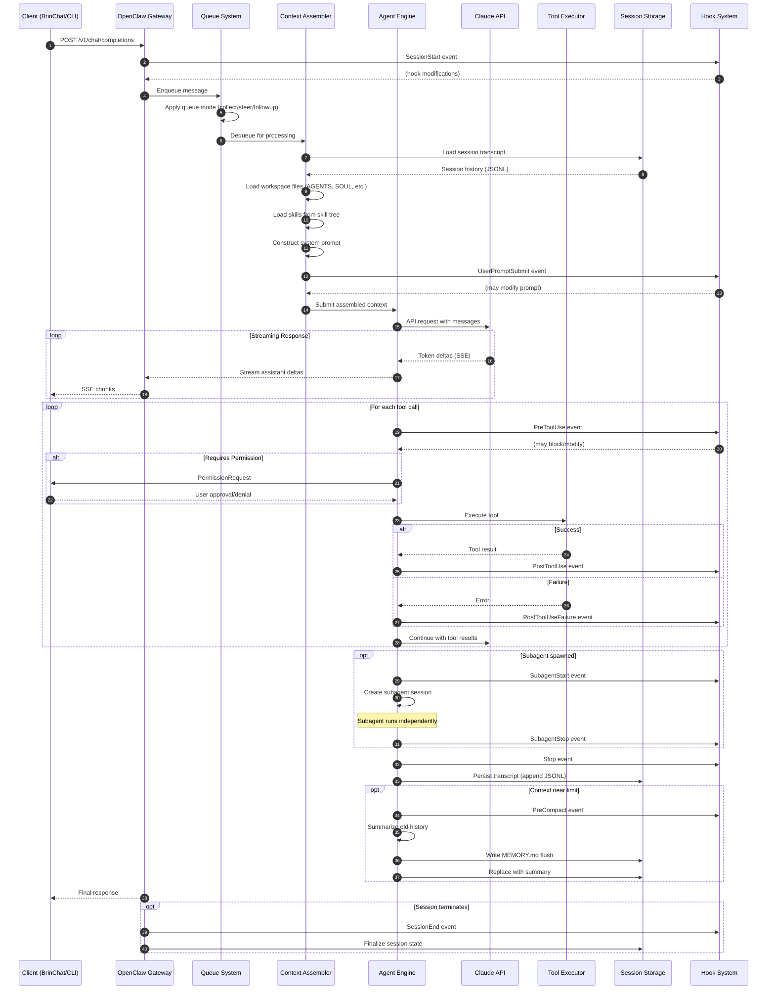

# Claude Code Session Lifecycle

> **Version:** 1.0.0  
> **Last Updated:** 2026-01-31  
> **OpenClaw Version:** 2026.1.29  
> **Maintainer:** Brin (OpenClaw Agent)

This document provides a comprehensive technical reference for the Claude Code session lifecycle as implemented through the OpenClaw gateway. It covers the complete flow from session initialization through termination, including all lifecycle events, hooks, data structures, and external API interactions.

---

## Table of Contents

1. [Part 1: Lifecycle Overview](#part-1-lifecycle-overview)
   - [Narrative Walkthrough](#narrative-walkthrough)
   - [Major Phases](#major-phases)
   - [Temporal Relationships](#temporal-relationships)
   - [Data Flow Architecture](#data-flow-architecture)
   - [Sequence Diagram](#sequence-diagram)
2. [Part 2: Event Reference](#part-2-event-reference)
   - [SessionStart](#sessionstart)
   - [UserPromptSubmit](#userpromptsubmit)
   - [PreToolUse](#pretooluse)
   - [PermissionRequest](#permissionrequest)
   - [PostToolUse](#posttooluse)
   - [PostToolUseFailure](#posttoolusefailure)
   - [Notification](#notification)
   - [SubagentStart](#subagentstart)
   - [SubagentStop](#subagentstop)
   - [Stop](#stop)
   - [PreCompact](#precompact)
   - [SessionEnd](#sessionend)
3. [Part 3: Appendix](#part-3-appendix)
   - [A. API Reference](#a-api-reference)
   - [B. Data Structure Reference](#b-data-structure-reference)
   - [C. Glossary](#c-glossary)
4. [Additional Technical Coverage](#additional-technical-coverage)
   - [Race Conditions](#race-conditions)
   - [Error Recovery Paths](#error-recovery-paths)
   - [Caching Behaviors](#caching-behaviors)
   - [Authentication Flows](#authentication-flows)
   - [State Persistence Mechanisms](#state-persistence-mechanisms)

---

## Part 1: Lifecycle Overview

### Narrative Walkthrough

A typical Claude Code session follows this flow:

1. **Initialization**: A client (BrinChat, CLI, webchat, or external integration) connects to the OpenClaw gateway via HTTP REST or WebSocket RPC. The gateway validates authentication and resolves the target session.
2. **Context Assembly**: Before any model inference, OpenClaw loads workspace files (AGENTS.md, SOUL.md, USER.md, IDENTITY.md), skills from the skill tree, and existing session history from JSONL transcript files.
3. **User Prompt Processing**: When a message arrives, it enters the queue system. Depending on queue mode (`collect`, `steer`, `followup`, `interrupt`), the message may be batched with others, injected into an active run, or queued for the next turn.
4. **Model Inference**: The `runEmbeddedPiAgent` function executes the pi-agent-core runtime. This is where Claude processes the assembled context and generates responses.
5. **Tool Execution Loop**: Claude may invoke tools (exec, read, write, browser, etc.). Each tool call goes through `PreToolUse` → execution → `PostToolUse` (or `PostToolUseFailure`) events. Some tools require user approval via `PermissionRequest`.
6. **Streaming & Response**: During execution, three parallel event streams emit: assistant deltas (text chunks), tool events (state changes), and lifecycle events (phase markers).
7. **Persistence**: After execution completes, session state is written to disk as JSONL transcripts. The response is delivered to the originating channel.
8. **Compaction**: When context approaches limits, `PreCompact` fires and the system summarizes older conversation turns, optionally flushing important context to MEMORY.md first.
9. **Session End**: Sessions terminate via explicit command (`/reset`, `/new`), idle timeout, daily reset, or gateway shutdown.

### Major Phases

| Phase            | Duration                  | Key Activities                                                                              |
|------------------|---------------------------|---------------------------------------------------------------------------------------------|
| **Intake**           | ~10-50ms                  | Request validation, session resolution, run ID assignment                                   |
| **Context Assembly** | 50-500ms                  | Skill loading, workspace preparation, bootstrap file resolution, system prompt construction |
| **Model Inference**  | 500ms-10min               | Claude processing, reasoning, response generation                                           |
| **Tool Execution**   | Variable                  | Per-tool execution (can trigger nested model calls for subagents)                           |
| **Streaming**        | Concurrent with inference | Block chunking (100-500 chars), SSE delivery                                                |
| **Persistence**      | 10-100ms                  | Transcript JSONL append, session index update                                               |
| **Compaction**       | 1-30s                     | History summarization (only when triggered)                                                 |

### Temporal Relationships

```
Timeline (single turn):
────────────────────────────────────────────────────────────────────────────────►
│                                                                                │
├──┤ Intake      ├────┤ Context Assembly                                        │
   │             │                                                              │
   │             └────────────────────────────────────────────────────────────► │
   │                   │                                                        │
   │                   ├────────────┤ Model Inference (may loop with tools)     │
   │                   │            │                                           │
   │                   │            ├─────────────────────────────────────────► │
   │                   │            │ Streaming (concurrent)                    │
   │                   │            │                                           │
   │                   │            ├──┤ Tool 1 ├──┤ Tool 2 ├──┤ Tool N        │
   │                   │            │                                           │
   │                   │            └────────────────────────────────────────►  │
   │                   │                                                     │  │
   │                   │                                               ├────┤ │  │
   │                   │                                               Persist │
   │                   │                                                        │
SessionStart    UserPromptSubmit                                            Stop
```

### Data Flow Architecture

```
                                    ┌─────────────────────────────────────────┐
                                    │             EXTERNAL CLIENTS            │
                                    ├─────────────────────────────────────────┤
                                    │  BrinChat  │  CLI  │  Webchat  │  API   │
                                    └──────┬─────┴───┬───┴─────┬─────┴────┬───┘
                                           │         │         │          │
                                           ▼         ▼         ▼          ▼
┌──────────────────────────────────────────────────────────────────────────────┐
│                           OPENCLAW GATEWAY (:18789)                          │
├──────────────────────────────────────────────────────────────────────────────┤
│                                                                              │
│  ┌─────────────┐   ┌─────────────┐   ┌─────────────┐   ┌─────────────┐      │
│  │   HTTP      │   │  WebSocket  │   │    Queue    │   │   Session   │      │
│  │   REST      │   │    RPC      │   │   System    │   │   Router    │      │
│  │  /v1/...    │   │             │   │             │   │             │      │
│  └──────┬──────┘   └──────┬──────┘   └──────┬──────┘   └──────┬──────┘      │
│         │                 │                 │                 │              │
│         └────────────────┬┴─────────────────┴─────────────────┘              │
│                          │                                                   │
│                          ▼                                                   │
│  ┌───────────────────────────────────────────────────────────────────────┐  │
│  │                        AGENT EXECUTION ENGINE                          │  │
│  ├───────────────────────────────────────────────────────────────────────┤  │
│  │                                                                        │  │
│  │  ┌─────────────┐   ┌─────────────┐   ┌─────────────┐                  │  │
│  │  │   Context   │   │   Model     │   │    Tool     │                  │  │
│  │  │  Assembler  │──▶│  Inference  │──▶│  Executor   │                  │  │
│  │  │             │   │             │   │             │                  │  │
│  │  └──────┬──────┘   └──────┬──────┘   └──────┬──────┘                  │  │
│  │         │                 │                 │                          │  │
│  │         ▼                 ▼                 ▼                          │  │
│  │  ┌─────────────────────────────────────────────────────────────────┐  │  │
│  │  │                      HOOK SYSTEM                                 │  │  │
│  │  │  SessionStart │ PreToolUse │ PostToolUse │ PreCompact │ Stop    │  │  │
│  │  └─────────────────────────────────────────────────────────────────┘  │  │
│  │                                                                        │  │
│  └───────────────────────────────────────────────────────────────────────┘  │
│                                                                              │
└──────────────────────────────────────────────────────────────────────────────┘
         │                           │                           │
         ▼                           ▼                           ▼
┌─────────────────┐       ┌─────────────────┐       ┌─────────────────────────┐
│    WORKSPACE    │       │    SESSIONS     │       │    EXTERNAL SERVICES    │
├─────────────────┤       ├─────────────────┤       ├─────────────────────────┤
│ ~/clawd/        │       │ ~/.openclaw/    │       │ Claude API (Anthropic)  │
│ ├── AGENTS.md   │       │ └── agents/     │       │ Local Ollama            │
│ ├── SOUL.md     │       │     └── main/   │       │ Brave Search            │
│ ├── USER.md     │       │         ├──     │       │ Local Whisper STT       │
│ ├── MEMORY.md   │       │ sessions/       │       │ Local Qwen TTS          │
│ ├── memory/     │       │         ├──     │       │ Nextcloud               │
│ └── skills/     │       │  main.jsonl     │       │ Browser (Chromium)      │
└─────────────────┘       └─────────────────┘       └─────────────────────────┘
```

### Sequence Diagram



---

## Part 2: Event Reference

### SessionStart

**Fires When:** A session begins or resumes. This occurs when the gateway receives the first message for a session key, or when a session is explicitly resumed after being idle.

#### Context Snapshot

| Property       | State                                     |
|----------------|-------------------------------------------|
| Prior events   | None (first event in session)             |
| Session state  | Initializing or resuming                  |
| Context stream | Empty (new) or loading from disk (resume) |
| Active runs    | 0                                         |

**What preceded it:**

- Client connected to gateway (HTTP or WebSocket)
- Authentication validated (Bearer token or loopback bypass)
- Session key resolved from `x-openclaw-session-key` header or derived from `user` field

#### Data in Motion

**Incoming Payload:**

```typescript
interface SessionStartEvent {
  type: 'session';
  action: 'start';
  sessionKey: string;         // e.g., "main" or "agent:main:main"
  agentId: string;            // e.g., "main"
  timestamp: number;          // Unix timestamp (ms)
  isResume: boolean;          // true if session existed on disk
  workspace: {
    name: string;             // Workspace directory name
    path: string;             // Absolute path
  };
  metadata: {
    channel?: string;         // Origin channel (webchat, discord, etc.)
    clientIp?: string;        // Client IP (if available)
    userAgent?: string;       // Client user agent
  };
}
```

**Example:**

```json
{
  "type": "session",
  "action": "start",
  "sessionKey": "agent:main:main",
  "agentId": "main",
  "timestamp": 1706644800000,
  "isResume": false,
  "workspace": {
    "name": "clawd",
    "path": "/home/tech/clawd"
  },
  "metadata": {
    "channel": "webchat",
    "clientIp": "127.0.0.1"
  }
}
```

#### Hooks & Triggers

| Hook Type     | Can Modify                | Can Block | Notes                           |
|---------------|---------------------------|-----------|---------------------------------|
| Gateway Hooks | Yes (workspace, metadata) | No        | Used for session initialization |
| Plugin Hooks  | Yes                       | No        | `before_agent_start` phase        |

**Hook Handler Signature:**

```typescript
const handler: HookHandler = async (event: SessionStartEvent) => {
  // Inject custom context
  event.metadata.customData = await loadCustomData(event.sessionKey);
  
  // Add initialization message
  event.messages.push('Session initialized with custom context');
};
```

#### Automatic Behaviors

1. **Session index update:** `~/.openclaw/agents/<agentId>/sessions/sessions.json` is updated with new/resumed session entry
2. **Workspace file loading:** AGENTS.md, SOUL.md, USER.md, IDENTITY.md are queued for loading
3. **Memory directory check:** `memory/` directory is created if missing
4. **Today's memory file:** `memory/YYYY-MM-DD.md` path is registered for the session

#### Context Stream State

| Content                  | Source                                            | Format |
|--------------------------|---------------------------------------------------|--------|
| Empty (new session)      | N/A                                               | N/A    |
| Session history (resume) | `~/.openclaw/agents/<agentId>/sessions/<key>.jsonl` | JSONL  |

#### Configurability

| Parameter        | User-adjustable | Location        | Default      |
|------------------|-----------------|-----------------|--------------|
| Session scope    | Yes             | `session.scope`   | `"per-sender"` |
| DM scope         | Yes             | `session.dmScope` | `"main"`       |
| Main session key | Yes             | `session.mainKey` | `"main"`       |
| Auto-resume      | No              | Hardcoded       | `true`         |

#### External Calls

None. SessionStart is an internal gateway event.

---

### UserPromptSubmit

**Fires When:** A prompt is submitted, before Claude processes it. This occurs after context assembly is complete and just before the model inference phase begins.

#### Context Snapshot

| Property       | State                                                                    |
|----------------|--------------------------------------------------------------------------|
| Prior events   | SessionStart (if new), potentially previous UserPromptSubmit/Stop cycles |
| Session state  | Active                                                                   |
| Context stream | Fully assembled (system prompt + history + current message)              |
| Active runs    | 1 (this run)                                                             |

**What preceded it:**

- Message entered queue system
- Queue mode applied (collect/steer/followup)
- Debounce period elapsed (`debounceMs`)
- Context assembly completed (skills loaded, workspace files loaded)

#### Data in Motion

**Incoming Payload:**

```typescript
interface UserPromptSubmitEvent {
  type: 'agent';
  action: 'prompt_submit';
  sessionKey: string;
  runId: string;              // Unique run identifier
  timestamp: number;
  prompt: {
    content: string;          // User message text
    images?: ImageData[];     // Attached images (base64)
    files?: FileAttachment[]; // Attached files
  };
  context: {
    systemPrompt: string;     // Assembled system prompt
    messageCount: number;     // Total messages in context
    estimatedTokens: number;  // Approximate token count
    skills: string[];         // Loaded skill names
  };
  metadata: {
    queueMode: string;        // collect | steer | followup | interrupt
    wasQueued: boolean;       // true if message waited in queue
    queuedMs?: number;        // Time spent in queue
  };
}
```

**Example:**

```json
{
  "type": "agent",
  "action": "prompt_submit",
  "sessionKey": "agent:main:main",
  "runId": "run-abc123",
  "timestamp": 1706644801000,
  "prompt": {
    "content": "What files are in the current directory?",
    "images": [],
    "files": []
  },
  "context": {
    "systemPrompt": "You are Brin, a helpful AI assistant...",
    "messageCount": 15,
    "estimatedTokens": 12500,
    "skills": ["openclaw", "cli-agents", "orchestration"]
  },
  "metadata": {
    "queueMode": "collect",
    "wasQueued": false
  }
}
```

#### Hooks & Triggers

| Hook Type     | Can Modify            | Can Block | Notes                           |
|---------------|-----------------------|-----------|---------------------------------|
| Gateway Hooks | Yes (prompt, context) | Yes       | Can reject or transform prompts |
| Plugin Hooks  | Yes                   | Yes       | `before_agent_start` phase        |

**Hook Handler Signature:**

```typescript
const handler: HookHandler = async (event: UserPromptSubmitEvent) => {
  // Content filtering
  if (containsBlockedContent(event.prompt.content)) {
    event.preventDefault = true;
    event.messages.push('Message blocked by content filter');
    return;
  }
  
  // Prompt injection/transformation
  event.prompt.content = await enrichPrompt(event.prompt.content);
};
```

#### Automatic Behaviors

1. **Typing indicator:** Channel-specific typing indicator is started
2. **Run tracking:** Run ID is registered in active runs map
3. **Concurrency check:** Lane availability verified (session: 1, main: 4)
4. **Timeout timer:** Execution timeout started (default: 600s)

#### Context Stream State

| Content              | Source                              | Format    |
|----------------------|-------------------------------------|-----------|
| System prompt        | Built from workspace files + skills | String    |
| Conversation history | Session JSONL + current message     | Message\[\] |
| Tool definitions     | Agent config + skill definitions    | Tool\[\]    |

**Context Assembly Order:**

1. Base system prompt (hardcoded)
2. SOUL.md content (if exists)
3. IDENTITY.md content (if exists)
4. USER.md content (if exists)
5. AGENTS.md operating instructions
6. Skills context (from loaded skills)
7. BOOTSTRAP.md (if exists, then deleted)
8. Runtime context injection

#### Configurability

| Parameter      | User-adjustable | Location                       | Default   |
|----------------|-----------------|--------------------------------|-----------|
| Queue mode     | Yes             | `messages.queue.mode`            | `"collect"` |
| Debounce       | Yes             | `messages.queue.debounceMs`      | `1000`      |
| Timeout        | Yes             | `agents.defaults.timeoutSeconds` | `600`       |
| Max concurrent | Yes             | `agents.defaults.maxConcurrent`  | `4`         |

#### External Calls

None directly. The subsequent model inference will call the Claude API.

---

### PreToolUse

**Fires When:** Before a tool call executes. This is the primary interception point for tool-level authorization, logging, and parameter modification.

#### Context Snapshot

| Property       | State                                                             |
|----------------|-------------------------------------------------------------------|
| Prior events   | UserPromptSubmit, potentially other PreToolUse/PostToolUse cycles |
| Session state  | Active (mid-inference)                                            |
| Context stream | Includes assistant response up to this point                      |
| Active runs    | 1                                                                 |

**What preceded it:**

- Claude model inference produced a tool call request
- Tool name validated against allow-list
- Tool parameters parsed from JSON

#### Data in Motion

**Incoming Payload:**

```typescript
interface PreToolUseEvent {
  type: 'tool';
  action: 'pre_use';
  sessionKey: string;
  runId: string;
  timestamp: number;
  tool: {
    name: string;             // Tool identifier (e.g., "exec", "Read", "browser")
    arguments: Record<string, unknown>;
    category: string;         // Tool category
  };
  context: {
    previousToolCalls: number;  // Count of tool calls in this run
    assistantText: string;      // Text generated before this call
  };
  approval: {
    required: boolean;        // Whether user approval is needed
    policy: string;           // Approval policy name
    autoApprove: boolean;     // Whether auto-approve is enabled
  };
}
```

**Example:**

```json
{
  "type": "tool",
  "action": "pre_use",
  "sessionKey": "agent:main:main",
  "runId": "run-abc123",
  "timestamp": 1706644802000,
  "tool": {
    "name": "exec",
    "arguments": {
      "command": "ls -la",
      "workdir": "/home/tech/clawd"
    },
    "category": "shell"
  },
  "context": {
    "previousToolCalls": 2,
    "assistantText": "Let me check the directory contents:\n"
  },
  "approval": {
    "required": false,
    "policy": "auto-approve-read",
    "autoApprove": true
  }
}
```

#### Hooks & Triggers

| Hook Type     | Can Modify      | Can Block | Notes                   |
|---------------|-----------------|-----------|-------------------------|
| Gateway Hooks | Yes (arguments) | Yes       | Core interception point |
| Plugin Hooks  | Yes             | Yes       | `before_tool_call` phase  |

**Hook Handler Signature:**

```typescript
const handler: HookHandler = async (event: PreToolUseEvent) => {
  // Security check
  if (event.tool.name === 'exec') {
    const cmd = event.tool.arguments.command as string;
    if (isDestructiveCommand(cmd)) {
      event.preventDefault = true;
      event.messages.push('Destructive command blocked');
      return;
    }
  }
  
  // Argument transformation
  if (event.tool.name === 'browser') {
    event.tool.arguments.headless = true; // Force headless
  }
  
  // Audit logging
  await auditLog('tool_attempt', event);
};
```

#### Automatic Behaviors

1. **Tool allowlist check:** Tool name verified against agent's tool policy
2. **Parameter validation:** Arguments validated against tool schema (TypeBox)
3. **Approval check:** Determines if `PermissionRequest` is needed
4. **Timeout calculation:** Per-tool timeout applied (if configured)

#### Context Stream State

| Content           | Source            | Format          |
|-------------------|-------------------|-----------------|
| Pending tool call | Claude response   | ToolCall object |
| Tool definition   | Skill or built-in | ToolSchema      |
| Previous results  | Context stream    | ToolResult\[\]    |

#### Configurability

| Parameter             | User-adjustable | Location             | Default        |
|-----------------------|-----------------|----------------------|----------------|
| Tool allowlist        | Yes             | `tools.allowlist`      | All enabled    |
| Tool denylist         | Yes             | `tools.denylist`       | Empty          |
| Auto-approve patterns | Yes             | `approvals.rules`      | Read-only auto |
| Per-tool timeout      | Yes             | `tools.<name>.timeout` | Inherit global |

#### External Calls

None. Actual tool execution happens after this event completes.

---

### PermissionRequest

**Fires When:** A permission dialog appears, requiring user approval before a tool can execute.

#### Context Snapshot

| Property       | State                                 |
|----------------|---------------------------------------|
| Prior events   | PreToolUse (blocked pending approval) |
| Session state  | Active (paused awaiting approval)     |
| Context stream | Frozen at pre-tool state              |
| Active runs    | 1 (paused)                            |

**What preceded it:**

- PreToolUse event completed
- Tool requires explicit approval (based on policy)
- No matching auto-approve rule found

#### Data in Motion

**Outgoing Payload (to client):**

```typescript
interface PermissionRequestEvent {
  type: 'approval';
  action: 'request';
  sessionKey: string;
  runId: string;
  requestId: string;          // Unique approval request ID
  timestamp: number;
  tool: {
    name: string;
    arguments: Record<string, unknown>;
    description: string;      // Human-readable description
  };
  risk: {
    level: 'low' | 'medium' | 'high' | 'critical';
    reasons: string[];        // Why this risk level
  };
  timeout: {
    ms: number;               // How long to wait for response
    action: 'deny' | 'skip';  // What happens on timeout
  };
}
```

**Incoming Response:**

```typescript
interface PermissionResponse {
  requestId: string;
  decision: 'approve' | 'deny' | 'approve_session' | 'approve_always';
  timestamp: number;
}
```

**Example Request:**

```json
{
  "type": "approval",
  "action": "request",
  "sessionKey": "agent:main:main",
  "runId": "run-abc123",
  "requestId": "approval-xyz789",
  "timestamp": 1706644803000,
  "tool": {
    "name": "exec",
    "arguments": {
      "command": "rm -rf ./temp"
    },
    "description": "Delete directory: ./temp"
  },
  "risk": {
    "level": "high",
    "reasons": ["Destructive file operation", "Recursive deletion"]
  },
  "timeout": {
    "ms": 60000,
    "action": "deny"
  }
}
```

#### Hooks & Triggers

| Hook Type     | Can Modify             | Can Block | Notes                |
|---------------|------------------------|-----------|----------------------|
| Gateway Hooks | No                     | No        | Observe only         |
| Plugin Hooks  | Yes (can auto-respond) | Yes       | Can inject decisions |

**Hook Handler Signature:**

```typescript
const handler: HookHandler = async (event: PermissionRequestEvent) => {
  // Auto-approve based on custom logic
  if (isTrustedPattern(event.tool)) {
    event.autoResponse = {
      decision: 'approve',
      reason: 'Matched trusted pattern'
    };
  }
  
  // Log all permission requests
  await auditLog('permission_request', event);
};
```

#### Automatic Behaviors

1. **Notification dispatch:** Desktop/mobile notification sent (if configured)
2. **Timeout timer:** Started based on `timeout.ms`
3. **UI update:** CLI/webchat displays approval dialog
4. **Decision caching:** `approve_always` decisions stored for future auto-approve

#### Context Stream State

| Content          | Source                     | Format          |
|------------------|----------------------------|-----------------|
| Pending approval | In-memory state            | ApprovalRequest |
| Approval history | `~/.openclaw/approvals.json` | JSON            |

#### Configurability

| Parameter                 | User-adjustable | Location                | Default |
|---------------------------|-----------------|-------------------------|---------|
| Approval timeout          | Yes             | `approvals.timeout`       | `60000`   |
| Default action on timeout | Yes             | `approvals.timeoutAction` | `"deny"`  |
| Notification delivery     | Yes             | `notifications.delivery`  | `"auto"`  |
| Always-approve storage    | Yes             | `approvals.persistAlways` | `true`    |

#### External Calls

| Service              | Purpose    | Endpoint                  |
|----------------------|------------|---------------------------|
| Desktop notification | Alert user | OS notification API       |
| Mobile push          | Alert user | Push notification service |

---

### PostToolUse

**Fires When:** After a tool call succeeds and returns a result.

#### Context Snapshot

| Property       | State                                     |
|----------------|-------------------------------------------|
| Prior events   | PreToolUse, potentially PermissionRequest |
| Session state  | Active (mid-inference)                    |
| Context stream | Now includes tool result                  |
| Active runs    | 1                                         |

**What preceded it:**

- Tool executed successfully
- Result captured (stdout, return value, etc.)
- No exceptions thrown

#### Data in Motion

**Incoming Payload:**

```typescript
interface PostToolUseEvent {
  type: 'tool';
  action: 'post_use';
  sessionKey: string;
  runId: string;
  timestamp: number;
  tool: {
    name: string;
    arguments: Record<string, unknown>;
  };
  result: {
    success: true;
    output: unknown;          // Tool-specific output
    duration: number;         // Execution time (ms)
    truncated: boolean;       // Whether output was truncated
  };
  context: {
    tokensBefore: number;
    tokensAfter: number;
    outputTokens: number;
  };
}
```

**Example:**

```json
{
  "type": "tool",
  "action": "post_use",
  "sessionKey": "agent:main:main",
  "runId": "run-abc123",
  "timestamp": 1706644804000,
  "tool": {
    "name": "Read",
    "arguments": {
      "path": "/home/tech/clawd/AGENTS.md"
    }
  },
  "result": {
    "success": true,
    "output": "# AGENTS.md - Your Workspace\n\nThis folder is home...",
    "duration": 45,
    "truncated": false
  },
  "context": {
    "tokensBefore": 12500,
    "tokensAfter": 13200,
    "outputTokens": 700
  }
}
```

#### Hooks & Triggers

| Hook Type     | Can Modify   | Can Block | Notes                                |
|---------------|--------------|-----------|--------------------------------------|
| Gateway Hooks | Yes (result) | No        | Can transform output                 |
| Plugin Hooks  | Yes          | No        | `after_tool_call`, `tool_result_persist` |

**Hook Handler Signature:**

```typescript
const handler: HookHandler = async (event: PostToolUseEvent) => {
  // Redact sensitive data from results
  if (event.tool.name === 'Read') {
    event.result.output = redactSecrets(event.result.output);
  }
  
  // Custom logging
  await toolLog({
    tool: event.tool.name,
    duration: event.result.duration,
    success: true
  });
};
```

#### Automatic Behaviors

1. **Result injection:** Tool output added to context stream
2. **Token accounting:** Context token count updated
3. **Transcript append:** Tool call + result appended to session JSONL
4. **Pruning check:** May trigger soft pruning if context high

#### Context Stream State

| Content         | Source            | Format         |
|-----------------|-------------------|----------------|
| Tool result     | Tool executor     | Varies by tool |
| Updated context | Context assembler | Messages array |

#### Configurability

| Parameter         | User-adjustable | Location                     | Default |
|-------------------|-----------------|------------------------------|---------|
| Max output tokens | Yes             | `tools.<name>.maxOutputTokens` | `4096`    |
| Output truncation | Yes             | `tools.truncateOutput`         | `true`    |
| Result caching    | Some tools      | Tool-specific                | Varies  |

#### External Calls

Depends on the tool that executed. See [A. API Reference](#a-api-reference) for tool-specific external calls.

---

### PostToolUseFailure

**Fires When:** After a tool call fails with an error.

#### Context Snapshot

| Property       | State                                     |
|----------------|-------------------------------------------|
| Prior events   | PreToolUse, potentially PermissionRequest |
| Session state  | Active (mid-inference, handling error)    |
| Context stream | May include partial output or error       |
| Active runs    | 1                                         |

**What preceded it:**

- Tool execution attempted
- Exception thrown or non-zero exit code
- Error captured and formatted

#### Data in Motion

**Incoming Payload:**

```typescript
interface PostToolUseFailureEvent {
  type: 'tool';
  action: 'post_use_failure';
  sessionKey: string;
  runId: string;
  timestamp: number;
  tool: {
    name: string;
    arguments: Record<string, unknown>;
  };
  error: {
    code: string;             // Error code (e.g., "ENOENT", "TIMEOUT")
    message: string;          // Human-readable error
    stack?: string;           // Stack trace (if available)
    exitCode?: number;        // Process exit code (for exec)
    stderr?: string;          // Stderr output (for exec)
  };
  context: {
    duration: number;         // Time until failure
    retryable: boolean;       // Whether retry might succeed
    retryCount: number;       // How many retries attempted
  };
}
```

**Example:**

```json
{
  "type": "tool",
  "action": "post_use_failure",
  "sessionKey": "agent:main:main",
  "runId": "run-abc123",
  "timestamp": 1706644805000,
  "tool": {
    "name": "exec",
    "arguments": {
      "command": "cat /nonexistent/file"
    }
  },
  "error": {
    "code": "ENOENT",
    "message": "No such file or directory",
    "exitCode": 1,
    "stderr": "cat: /nonexistent/file: No such file or directory"
  },
  "context": {
    "duration": 23,
    "retryable": false,
    "retryCount": 0
  }
}
```

#### Hooks & Triggers

| Hook Type     | Can Modify          | Can Block | Notes                        |
|---------------|---------------------|-----------|------------------------------|
| Gateway Hooks | Yes (error message) | No        | Can sanitize errors          |
| Plugin Hooks  | Yes                 | No        | `after_tool_call` (with error) |

**Hook Handler Signature:**

```typescript
const handler: HookHandler = async (event: PostToolUseFailureEvent) => {
  // Error classification
  const severity = classifyError(event.error);
  
  // Alert on critical errors
  if (severity === 'critical') {
    await sendAlert({
      type: 'tool_failure',
      tool: event.tool.name,
      error: event.error.message
    });
  }
  
  // Provide helpful context
  event.error.suggestion = getSuggestion(event.error.code);
};
```

#### Automatic Behaviors

1. **Error formatting:** Error converted to user-friendly message
2. **Context injection:** Error message added to context (Claude sees it)
3. **Retry logic:** Some errors trigger automatic retry
4. **Transcript logging:** Error logged to session JSONL

#### Context Stream State

| Content        | Source        | Format |
|----------------|---------------|--------|
| Error message  | Tool executor | String |
| Partial output | Tool (if any) | Varies |

#### Configurability

| Parameter           | User-adjustable | Location                  | Default       |
|---------------------|-----------------|---------------------------|---------------|
| Retry attempts      | Yes             | `tools.<name>.retries`      | `0`             |
| Retry delay         | Yes             | `tools.<name>.retryDelayMs` | `1000`          |
| Include stack trace | No              | Hardcoded                 | `false` in prod |

#### External Calls

None for the failure event itself. The failed tool may have made external calls before failing.

---

### Notification

**Fires When:** Claude Code sends a notification to the user (desktop, mobile, or in-app).

#### Context Snapshot

| Property       | State                                               |
|----------------|-----------------------------------------------------|
| Prior events   | Varies (often Stop or long-running tool completion) |
| Session state  | Active or idle                                      |
| Context stream | Current state                                       |
| Active runs    | 0 or 1                                              |

**What preceded it:**

- Claude completed a response and wants to alert user
- Long-running background task finished
- Scheduled reminder triggered
- Error requiring user attention occurred

#### Data in Motion

**Outgoing Payload:**

```typescript
interface NotificationEvent {
  type: 'notification';
  action: 'send';
  sessionKey: string;
  timestamp: number;
  notification: {
    title: string;
    body: string;
    priority: 'passive' | 'active' | 'timeSensitive';
    sound?: string;           // Sound name or path
    delivery: 'system' | 'overlay' | 'auto';
  };
  metadata: {
    source: string;           // What triggered the notification
    actionUrl?: string;       // Deep link for notification tap
    dismissable: boolean;
  };
}
```

**Example:**

```json
{
  "type": "notification",
  "action": "send",
  "sessionKey": "agent:main:main",
  "timestamp": 1706644806000,
  "notification": {
    "title": "Task Complete",
    "body": "Your file processing has finished.",
    "priority": "active",
    "sound": "default",
    "delivery": "system"
  },
  "metadata": {
    "source": "background_task",
    "actionUrl": "openclaw://session/main",
    "dismissable": true
  }
}
```

#### Hooks & Triggers

| Hook Type     | Can Modify    | Can Block | Notes                      |
|---------------|---------------|-----------|----------------------------|
| Gateway Hooks | Yes (content) | Yes       | Can suppress notifications |
| Plugin Hooks  | Yes           | Yes       | Pre-notification phase     |

**Hook Handler Signature:**

```typescript
const handler: HookHandler = async (event: NotificationEvent) => {
  // Suppress during quiet hours
  const hour = new Date().getHours();
  if (hour >= 23 || hour < 8) {
    if (event.notification.priority !== 'timeSensitive') {
      event.preventDefault = true;
      return;
    }
  }
  
  // Customize notification
  event.notification.sound = 'custom-sound';
};
```

#### Automatic Behaviors

1. **Platform detection:** OS-appropriate notification API selected
2. **Rate limiting:** Notifications throttled if too frequent
3. **Grouping:** Multiple notifications may be grouped
4. **Badge update:** App badge count updated (iOS/macOS)

#### Context Stream State

Not modified by notifications.

#### Configurability

| Parameter             | User-adjustable | Location                 | Default   |
|-----------------------|-----------------|--------------------------|-----------|
| Notification delivery | Yes             | `notifications.delivery`   | `"auto"`    |
| Sound                 | Yes             | `notifications.sound`      | `"default"` |
| Priority default      | Yes             | `notifications.priority`   | `"active"`  |
| Quiet hours           | Yes             | `notifications.quietHours` | None      |

#### External Calls

| Service           | Purpose       | Method             |
|-------------------|---------------|--------------------|
| OS notification   | Desktop alert | Platform API       |
| Push notification | Mobile alert  | Push service       |
| Node notification | Remote device | OpenClaw nodes RPC |

---

### SubagentStart

**Fires When:** A subagent is spawned to handle a delegated task.

#### Context Snapshot

| Property       | State                                |
|----------------|--------------------------------------|
| Prior events   | PreToolUse (for sessions_spawn tool) |
| Session state  | Active (spawning subagent)           |
| Context stream | Parent context at spawn time         |
| Active runs    | Parent: 1, Subagent: 0→1             |

**What preceded it:**

- Claude decided to spawn a subagent
- `sessions_spawn` tool invoked
- Subagent session key generated
- Subagent lane availability confirmed

#### Data in Motion

**Incoming Payload:**

```typescript
interface SubagentStartEvent {
  type: 'subagent';
  action: 'start';
  parentSessionKey: string;
  subagentSessionKey: string;
  timestamp: number;
  spawn: {
    label: string;            // User-defined label
    task: string;             // Task description
    model?: string;           // Override model for subagent
    workspace?: string;       // Subagent workspace path
    timeout?: number;         // Subagent timeout (ms)
  };
  context: {
    inheritedContext: string[];  // What context was passed
    parentRunId: string;
  };
}
```

**Example:**

```json
{
  "type": "subagent",
  "action": "start",
  "parentSessionKey": "agent:main:main",
  "subagentSessionKey": "agent:main:subagent:7684f628-be2d-4819-904b-bf5f2b331e08",
  "timestamp": 1706644807000,
  "spawn": {
    "label": "session-lifecycle-docs",
    "task": "Create comprehensive technical documentation...",
    "model": null,
    "workspace": "/home/tech/clawd",
    "timeout": 600000
  },
  "context": {
    "inheritedContext": ["workspace_files", "skill_definitions"],
    "parentRunId": "run-abc123"
  }
}
```

#### Hooks & Triggers

| Hook Type     | Can Modify         | Can Block | Notes             |
|---------------|--------------------|-----------|-------------------|
| Gateway Hooks | Yes (spawn params) | Yes       | Can prevent spawn |
| Plugin Hooks  | Yes                | Yes       | Pre-spawn phase   |

**Hook Handler Signature:**

```typescript
const handler: HookHandler = async (event: SubagentStartEvent) => {
  // Track subagent count
  const count = await getActiveSubagentCount(event.parentSessionKey);
  if (count >= 4) {
    event.preventDefault = true;
    event.messages.push('Maximum subagent limit reached');
    return;
  }
  
  // Inject context
  event.spawn.context = await buildSubagentContext(event);
};
```

#### Automatic Behaviors

1. **Session creation:** Subagent session created in sessions directory
2. **Lane reservation:** Subagent lane slot reserved
3. **Context injection:** Subagent context file written
4. **Parent tracking:** Parent notified of subagent ID

#### Context Stream State

| Content           | Source                | Format          |
|-------------------|-----------------------|-----------------|
| Subagent context  | Generated from parent | Markdown        |
| Task instructions | Spawn parameters      | String          |
| Inherited files   | Workspace             | File references |

#### Configurability

| Parameter        | User-adjustable | Location                                | Default |
|------------------|-----------------|-----------------------------------------|---------|
| Max subagents    | Yes             | `agents.defaults.subagents.maxConcurrent` | `8`       |
| Subagent timeout | Yes             | `agents.defaults.subagents.timeout`       | `600000`  |
| Inherit context  | Yes             | Spawn-time                              | `true`    |

#### External Calls

Same as parent session (Claude API, etc.).

---

### SubagentStop

**Fires When:** A subagent finishes its task (success, failure, or timeout).

#### Context Snapshot

| Property       | State                                                |
|----------------|------------------------------------------------------|
| Prior events   | SubagentStart, subagent's own lifecycle events       |
| Session state  | Subagent completing, parent may be active or waiting |
| Context stream | Subagent's final context                             |
| Active runs    | Subagent: 1→0                                        |

**What preceded it:**

- Subagent completed its task
- Final response generated
- Session finalization in progress

#### Data in Motion

**Incoming Payload:**

```typescript
interface SubagentStopEvent {
  type: 'subagent';
  action: 'stop';
  parentSessionKey: string;
  subagentSessionKey: string;
  timestamp: number;
  result: {
    status: 'success' | 'failure' | 'timeout' | 'cancelled';
    output?: string;          // Final output (for success)
    error?: string;           // Error message (for failure)
    duration: number;         // Total execution time (ms)
  };
  metrics: {
    toolCalls: number;
    tokensUsed: number;
    modelCalls: number;
  };
}
```

**Example:**

```json
{
  "type": "subagent",
  "action": "stop",
  "parentSessionKey": "agent:main:main",
  "subagentSessionKey": "agent:main:subagent:7684f628-be2d-4819-904b-bf5f2b331e08",
  "timestamp": 1706644907000,
  "result": {
    "status": "success",
    "output": "Documentation complete. Created /home/tech/projects/BrinChat/docs/session-lifecycle.md",
    "duration": 100000
  },
  "metrics": {
    "toolCalls": 15,
    "tokensUsed": 45000,
    "modelCalls": 8
  }
}
```

#### Hooks & Triggers

| Hook Type     | Can Modify   | Can Block | Notes                |
|---------------|--------------|-----------|----------------------|
| Gateway Hooks | Yes (result) | No        | Can transform output |
| Plugin Hooks  | Yes          | No        | Post-subagent phase  |

**Hook Handler Signature:**

```typescript
const handler: HookHandler = async (event: SubagentStopEvent) => {
  // Report subagent completion
  await notifyParent(event.parentSessionKey, {
    subagent: event.subagentSessionKey,
    status: event.result.status,
    output: event.result.output
  });
  
  // Metrics collection
  await recordMetrics('subagent_execution', event.metrics);
};
```

#### Automatic Behaviors

1. **Lane release:** Subagent lane slot released
2. **Parent notification:** Parent session receives completion message
3. **Session cleanup:** Subagent session marked complete
4. **Transcript finalization:** Session JSONL closed

#### Context Stream State

| Content           | Source            | Format |
|-------------------|-------------------|--------|
| Final output      | Subagent session  | String |
| Execution summary | Metrics collector | Object |

#### Configurability

| Parameter          | User-adjustable | Location         | Default |
|--------------------|-----------------|------------------|---------|
| Auto-cleanup       | No              | Hardcoded        | `true`    |
| Persist transcript | Yes             | `sessions.persist` | `true`    |

#### External Calls

None for the stop event itself.

---

### Stop

**Fires When:** Claude finishes responding to the current prompt.

#### Context Snapshot

| Property       | State                                    |
|----------------|------------------------------------------|
| Prior events   | UserPromptSubmit, tool cycles, streaming |
| Session state  | Active → idle                            |
| Context stream | Complete response in context             |
| Active runs    | 1 → 0                                    |

**What preceded it:**

- Claude model finished generating response
- All tool calls completed
- Final text streamed to client
- `finish_reason` received from model

#### Data in Motion

**Incoming Payload:**

```typescript
interface StopEvent {
  type: 'lifecycle';
  action: 'stop';
  sessionKey: string;
  runId: string;
  timestamp: number;
  response: {
    finishReason: 'stop' | 'tool_use' | 'max_tokens' | 'content_filter';
    textLength: number;
    hasToolCalls: boolean;
  };
  metrics: {
    duration: number;         // Total run time (ms)
    tokensIn: number;         // Prompt tokens
    tokensOut: number;        // Completion tokens
    toolCalls: number;        // Number of tool invocations
    modelCalls: number;       // Number of API calls
  };
  stream: {
    chunksEmitted: number;
    totalBytes: number;
  };
}
```

**Example:**

```json
{
  "type": "lifecycle",
  "action": "stop",
  "sessionKey": "agent:main:main",
  "runId": "run-abc123",
  "timestamp": 1706644810000,
  "response": {
    "finishReason": "stop",
    "textLength": 1523,
    "hasToolCalls": true
  },
  "metrics": {
    "duration": 8500,
    "tokensIn": 12500,
    "tokensOut": 850,
    "toolCalls": 3,
    "modelCalls": 2
  },
  "stream": {
    "chunksEmitted": 45,
    "totalBytes": 6892
  }
}
```

#### Hooks & Triggers

| Hook Type     | Can Modify    | Can Block | Notes                 |
|---------------|---------------|-----------|-----------------------|
| Gateway Hooks | Yes (metrics) | No        | Post-processing only  |
| Plugin Hooks  | Yes           | No        | `after_execution` phase |

**Hook Handler Signature:**

```typescript
const handler: HookHandler = async (event: StopEvent) => {
  // Usage tracking
  await recordUsage({
    session: event.sessionKey,
    tokens: event.metrics.tokensIn + event.metrics.tokensOut,
    duration: event.metrics.duration
  });
  
  // Performance monitoring
  if (event.metrics.duration > 30000) {
    await logSlowExecution(event);
  }
};
```

#### Automatic Behaviors

1. **Transcript append:** Complete exchange appended to session JSONL
2. **Typing indicator stop:** Channel typing indicator cleared
3. **Lane release:** Session lane slot released
4. **Timeout cancellation:** Run timeout timer cancelled
5. **Queue check:** Next queued message (if any) may start processing

#### Context Stream State

| Content               | Source                         | Format       |
|-----------------------|--------------------------------|--------------|
| Complete conversation | Session history + new exchange | Messages\[\]   |
| Tool results          | Tool executor                  | ToolResult\[\] |

#### Configurability

| Parameter       | User-adjustable | Location                              | Default |
|-----------------|-----------------|---------------------------------------|---------|
| Block streaming | Yes             | `agents.defaults.blockStreamingDefault` | `"on"`    |
| Chunk size      | Yes             | `agents.defaults.blockStreamingChunk`   | `100-500` |
| Human delay     | Yes             | `agents.defaults.humanDelay`            | `"off"`   |

#### External Calls

None for the stop event itself.

---

### PreCompact

**Fires When:** Before context compaction begins (triggered when context approaches token limits).

#### Context Snapshot

| Property       | State                                             |
|----------------|---------------------------------------------------|
| Prior events   | Multiple conversation turns (context grown large) |
| Session state  | Active or between runs                            |
| Context stream | Near capacity                                     |
| Active runs    | 0 or 1                                            |

**What preceded it:**

- Context token count exceeded soft threshold
- Memory flush triggered (if enabled)
- Compaction scheduled

#### Data in Motion

**Incoming Payload:**

```typescript
interface PreCompactEvent {
  type: 'compaction';
  action: 'pre_compact';
  sessionKey: string;
  timestamp: number;
  context: {
    currentTokens: number;
    maxTokens: number;
    utilizationRatio: number;  // 0.0 - 1.0
  };
  compaction: {
    mode: 'default' | 'safeguard';
    strategy: string;          // Summarization strategy
    targetTokens: number;      // Target size after compaction
    preserveRecent: number;    // Messages to keep verbatim
  };
  memoryFlush: {
    enabled: boolean;
    triggered: boolean;
    flushPath?: string;        // MEMORY.md path
  };
}
```

**Example:**

```json
{
  "type": "compaction",
  "action": "pre_compact",
  "sessionKey": "agent:main:main",
  "timestamp": 1706644811000,
  "context": {
    "currentTokens": 185000,
    "maxTokens": 200000,
    "utilizationRatio": 0.925
  },
  "compaction": {
    "mode": "safeguard",
    "strategy": "summarize_old_turns",
    "targetTokens": 100000,
    "preserveRecent": 5
  },
  "memoryFlush": {
    "enabled": true,
    "triggered": true,
    "flushPath": "/home/tech/clawd/MEMORY.md"
  }
}
```

#### Hooks & Triggers

| Hook Type     | Can Modify              | Can Block | Notes                   |
|---------------|-------------------------|-----------|-------------------------|
| Gateway Hooks | Yes (compaction params) | Yes       | Can prevent compaction  |
| Plugin Hooks  | Yes                     | Yes       | `before_compaction` phase |

**Hook Handler Signature:**

```typescript
const handler: HookHandler = async (event: PreCompactEvent) => {
  // Preserve specific context
  event.compaction.preserveMessages = await getImportantMessages(event.sessionKey);
  
  // Custom memory flush
  if (event.memoryFlush.triggered) {
    await customMemoryFlush(event.sessionKey, event.memoryFlush.flushPath);
  }
  
  // Audit compaction
  await auditLog('compaction_start', event);
};
```

#### Automatic Behaviors

1. **Memory flush:** Agent writes important context to MEMORY.md
2. **Turn summarization:** Old conversation turns summarized
3. **Tool result pruning:** Old tool outputs truncated/removed
4. **Summary injection:** Compacted summary replaces detailed history

#### Context Stream State

| Content                    | Source            | Format              |
|----------------------------|-------------------|---------------------|
| Full history (pre-compact) | Session JSONL     | Messages\[\]          |
| Summary (post-compact)     | Compaction engine | Summarized messages |

#### Configurability

| Parameter       | User-adjustable | Location                                                   | Default     |
|-----------------|-----------------|------------------------------------------------------------|-------------|
| Compaction mode | Yes             | `agents.defaults.compaction.mode`                            | `"safeguard"` |
| Reserve tokens  | Yes             | `agents.defaults.compaction.reserveTokensFloor`              | `4000`        |
| Memory flush    | Yes             | `agents.defaults.compaction.memoryFlush.enabled`             | `true`        |
| Flush threshold | Yes             | `agents.defaults.compaction.memoryFlush.softThresholdTokens` | `150000`      |

#### External Calls

| Service    | Purpose          | Endpoint     |
|------------|------------------|--------------|
| Claude API | Generate summary | `/v1/messages` |

---

### SessionEnd

**Fires When:** A session terminates (explicitly or via timeout/reset).

#### Context Snapshot

| Property       | State                    |
|----------------|--------------------------|
| Prior events   | All prior session events |
| Session state  | Terminating              |
| Context stream | Final state              |
| Active runs    | 0                        |

**What preceded it:**

- Explicit `/reset` or `/new` command, OR
- Idle timeout reached, OR
- Daily reset time reached, OR
- Gateway shutdown, OR
- Manual session deletion

#### Data in Motion

**Incoming Payload:**

```typescript
interface SessionEndEvent {
  type: 'session';
  action: 'end';
  sessionKey: string;
  timestamp: number;
  reason: 'command' | 'idle_timeout' | 'daily_reset' | 'shutdown' | 'delete' | 'error';
  session: {
    startedAt: number;
    duration: number;         // Total session duration (ms)
    messageCount: number;
    tokenCount: number;
  };
  cleanup: {
    preserveTranscript: boolean;
    archivePath?: string;
  };
}
```

**Example:**

```json
{
  "type": "session",
  "action": "end",
  "sessionKey": "agent:main:main",
  "timestamp": 1706644900000,
  "reason": "command",
  "session": {
    "startedAt": 1706640000000,
    "duration": 4900000,
    "messageCount": 47,
    "tokenCount": 125000
  },
  "cleanup": {
    "preserveTranscript": true,
    "archivePath": "/home/tech/clawd/memory/transcripts/2026-01-31.jsonl"
  }
}
```

#### Hooks & Triggers

| Hook Type     | Can Modify    | Can Block | Notes               |
|---------------|---------------|-----------|---------------------|
| Gateway Hooks | Yes (cleanup) | No        | Final cleanup phase |
| Plugin Hooks  | Yes           | No        | `session_end` phase   |

**Built-in Hook: session-memory**

The bundled `session-memory` hook fires on `command:new`:

```typescript
const handler: HookHandler = async (event) => {
  if (event.type !== 'command' || event.action !== 'new') return;
  
  // Extract context from ending session
  const context = await extractSessionContext(event.sessionKey);
  
  // Store in memory system
  await memoryStore.save({
    sessionKey: event.sessionKey,
    context,
    timestamp: event.timestamp
  });
};
```

#### Automatic Behaviors

1. **Transcript archival:** Session JSONL optionally archived
2. **Session index update:** Session marked ended in index
3. **Memory persistence:** Important context written to MEMORY.md (if configured)
4. **Cleanup:** Temporary files removed
5. **Cache invalidation:** Session-specific caches cleared

#### Context Stream State

| Content          | Source        | Format     |
|------------------|---------------|------------|
| Final transcript | Session JSONL | JSONL file |
| Session metadata | Session index | JSON       |

#### Configurability

| Parameter           | User-adjustable | Location                  | Default                      |
|---------------------|-----------------|---------------------------|------------------------------|
| Preserve transcript | Yes             | `session.preserveOnEnd`     | `true`                         |
| Archive path        | Yes             | `session.archivePath`       | `memory/transcripts/`          |
| Reset triggers      | Yes             | `session.resetTriggers`     | `["/new", "/reset", "/clear"]` |
| Daily reset hour    | Yes             | `session.reset.atHour`      | None                         |
| Idle timeout        | Yes             | `session.reset.idleMinutes` | None                         |

#### External Calls

None for the end event itself.

---

## Part 3: Appendix

### A. API Reference

#### OpenClaw Gateway API

**Base URL:** `http://127.0.0.1:18789` (default)

##### POST /v1/chat/completions

OpenAI-compatible chat completions endpoint.

| Property       | Value            |
|----------------|------------------|
| Method         | POST             |
| Content-Type   | application/json |
| Authentication | Bearer token     |

**Request Schema:**

```typescript
interface ChatCompletionRequest {
  model: string;              // "openclaw" or "openclaw:<agentId>"
  messages: Message[];
  stream?: boolean;           // Default: false
  temperature?: number;       // 0.0 - 2.0
  top_p?: number;             // 0.0 - 1.0
  max_tokens?: number;
  user?: string;              // For session derivation
  tools?: Tool[];             // Function definitions
}

interface Message {
  role: 'system' | 'user' | 'assistant' | 'tool';
  content: string | ContentPart[];
  name?: string;
  tool_calls?: ToolCall[];
  tool_call_id?: string;
}
```

**Response Schema (non-streaming):**

```typescript
interface ChatCompletionResponse {
  id: string;
  object: 'chat.completion';
  created: number;
  model: string;
  choices: [{
    index: number;
    message: {
      role: 'assistant';
      content: string;
      tool_calls?: ToolCall[];
    };
    finish_reason: 'stop' | 'tool_use' | 'max_tokens';
  }];
  usage: {
    prompt_tokens: number;
    completion_tokens: number;
    total_tokens: number;
  };
}
```

**Response Schema (streaming):**

```
data: {"id":"...","object":"chat.completion.chunk","choices":[{"delta":{"content":"..."}}]}
data: {"id":"...","object":"chat.completion.chunk","choices":[{"delta":{},"finish_reason":"stop"}]}
data: [DONE]
```

**Headers:**

| Header                 | Required | Description                               |
|------------------------|----------|-------------------------------------------|
| Authorization          | Yes*     | `Bearer <token>` (* unless loopback bypass) |
| Content-Type           | Yes      | `application/json`                          |
| x-openclaw-session-key | No       | Explicit session routing                  |
| x-openclaw-agent-id    | No       | Override agent selection                  |

---

##### POST /tools/invoke

Programmatic tool execution.

| Property       | Value            |
|----------------|------------------|
| Method         | POST             |
| Content-Type   | application/json |
| Authentication | Bearer token     |

**Request Schema:**

```typescript
interface ToolInvokeRequest {
  tool: string;               // Tool name
  args: Record<string, unknown>;
  sessionKey?: string;        // Optional session context
  timeout?: number;           // Execution timeout (ms)
}
```

**Response Schema:**

```typescript
interface ToolInvokeResponse {
  success: boolean;
  result?: unknown;
  error?: {
    code: string;
    message: string;
  };
  duration: number;
}
```

---

##### GET /api/v1/check

Health probe endpoint.

| Property       | Value |
|----------------|-------|
| Method         | GET   |
| Authentication | None  |

**Response:**

```json
{
  "status": "ok",
  "version": "2026.1.29",
  "uptime": 86400
}
```

---

#### Claude/Anthropic API

**Base URL:** `https://api.anthropic.com`

##### POST /v1/messages

Claude Messages API (used internally by OpenClaw).

**Request Schema:**

```typescript
interface MessagesRequest {
  model: string;              // e.g., "claude-opus-4-5"
  max_tokens: number;
  messages: AnthropicMessage[];
  system?: string;
  temperature?: number;
  tools?: AnthropicTool[];
  stream?: boolean;
}
```

**Headers:**

| Header            | Value             |
|-------------------|-------------------|
| x-api-key         | Anthropic API key |
| anthropic-version | 2023-06-01        |
| Content-Type      | application/json  |

---

#### Local Whisper STT API

**Base URL:** `http://localhost:5001`

##### POST /v1/audio/transcriptions

OpenAI-compatible transcription endpoint.

**Request:**

- Content-Type: multipart/form-data
- Fields: `file` (audio file), `model` (ignored)

**Response:**

```json
{
  "text": "Transcribed text here"
}
```

---

#### Local Qwen TTS API

**Base URL:** `http://localhost:5002`

##### POST /v1/audio/speech

OpenAI-compatible speech synthesis endpoint.

**Request Schema:**

```typescript
interface SpeechRequest {
  model: string;              // Ignored (uses Qwen3-TTS)
  input: string;              // Text to synthesize
  voice: string;              // Voice profile name
}
```

**Response:** Audio file (WAV format)

---

#### Ollama API

**Base URL:** `http://localhost:11434`

##### POST /api/generate

Text generation endpoint.

**Request Schema:**

```typescript
interface OllamaGenerateRequest {
  model: string;
  prompt: string;
  stream?: boolean;
  images?: string[];          // Base64 encoded
  options?: {
    temperature?: number;
    num_ctx?: number;
  };
}
```

---

#### Brave Search API

**Base URL:** `https://api.search.brave.com`

##### GET /res/v1/web/search

Web search endpoint.

**Parameters:**

| Parameter   | Description          |
|-------------|----------------------|
| q           | Search query         |
| count       | Results count (1-20) |
| country     | Country code         |
| search_lang | Language code        |

**Headers:**

| Header               | Value         |
|----------------------|---------------|
| X-Subscription-Token | Brave API key |

---

### B. Data Structure Reference

#### Session Transcript (JSONL)

Each line in a session transcript file is a JSON object:

```typescript
// User message
{
  "role": "user",
  "content": "What files are in the directory?",
  "timestamp": "2026-01-31T10:00:00.000Z"
}

// Assistant message
{
  "role": "assistant",
  "content": "Let me check the directory contents.",
  "timestamp": "2026-01-31T10:00:01.000Z"
}

// Tool call
{
  "role": "assistant",
  "content": "",
  "tool_calls": [{
    "id": "call_abc123",
    "type": "function",
    "function": {
      "name": "exec",
      "arguments": "{\"command\":\"ls -la\"}"
    }
  }],
  "timestamp": "2026-01-31T10:00:02.000Z"
}

// Tool result
{
  "role": "tool",
  "tool_call_id": "call_abc123",
  "content": "total 48\ndrwxrwxr-x 10 tech tech 4096...",
  "timestamp": "2026-01-31T10:00:03.000Z"
}
```

---

#### Session Index (sessions.json)

```typescript
interface SessionIndex {
  sessions: {
    [key: string]: {
      id: string;
      createdAt: string;      // ISO timestamp
      lastActive: string;     // ISO timestamp
      messageCount: number;
      tokenCount?: number;
      status: 'active' | 'ended';
    };
  };
}
```

---

#### OpenClaw Configuration (openclaw.json)

```typescript
interface OpenClawConfig {
  meta: {
    lastTouchedVersion: string;
    lastTouchedAt: string;
  };
  env: {
    shellEnv: { enabled: boolean };
    vars: Record<string, string>;
  };
  agents: {
    defaults: {
      workspace: string;
      memorySearch: {
        enabled: boolean;
        provider: string;
        model: string;
      };
      contextPruning: {
        mode: 'off' | 'adaptive' | 'aggressive';
        ttl: string;
      };
      compaction: {
        mode: 'default' | 'safeguard';
      };
      heartbeat: {
        every: string;
      };
      maxConcurrent: number;
      subagents: {
        maxConcurrent: number;
      };
    };
  };
  messages: {
    queue: {
      mode: string;
      debounceMs: number;
      cap: number;
      drop: string;
    };
    tts: {
      auto: string;
      provider: string;
    };
  };
  hooks: {
    internal: {
      enabled: boolean;
      entries: Record<string, {
        enabled: boolean;
        env?: Record<string, string>;
      }>;
    };
  };
}
```

---

#### Tool Definition Schema

```typescript
interface ToolDefinition {
  type: 'function';
  function: {
    name: string;
    description: string;
    parameters: {
      type: 'object';
      properties: Record<string, {
        type: string;
        description?: string;
        enum?: string[];
      }>;
      required?: string[];
    };
  };
}
```

---

#### Hook Event Base Schema

```typescript
interface HookEvent {
  type: 'command' | 'agent' | 'gateway' | 'session' | 'tool' | 'compaction' | 'subagent' | 'lifecycle' | 'notification' | 'approval';
  action: string;
  sessionKey: string;
  timestamp: number;
  workspace?: {
    name: string;
    path: string;
  };
  metadata?: Record<string, unknown>;
  messages: string[];         // For hook feedback
  preventDefault?: boolean;   // Stop event propagation
}
```

---

### C. Glossary

| Term            | Definition                                                                                                                               |
|-----------------|------------------------------------------------------------------------------------------------------------------------------------------|
| **Agent**           | An instance of the Claude Code assistant with its own workspace, configuration, and session history. The default agent is called "main". |
| **Agent Loop**      | The execution cycle that processes a user prompt through context assembly, model inference, tool execution, and response generation.     |
| **Compaction**      | The process of summarizing old conversation history to reduce context size while preserving important information.                       |
| **Context Stream**  | The current state of all messages, tool results, and system prompts that will be sent to the model for inference.                        |
| **Context Pruning** | The process of truncating or removing old tool results to free context space before compaction is needed.                                |
| **Gateway**         | The OpenClaw daemon that handles connections, message routing, session management, and orchestrates agent execution.                     |
| **Hook**            | A function that intercepts lifecycle events to modify behavior, log activity, or block operations.                                       |
| **Lane**            | A concurrency slot that limits parallel execution. Sessions have 1 slot, main lane has 4, subagent lane has 8.                           |
| **Memory Flush**    | Pre-compaction process where the agent writes important context to MEMORY.md to preserve it across compaction.                           |
| **Queue Mode**      | How incoming messages are handled when the agent is busy: collect (batch), steer (inject), followup (wait), interrupt (abort).           |
| **Run**             | A single execution cycle triggered by a user prompt, including all tool calls and the final response.                                    |
| **Session**         | A persistent conversation context identified by a session key. Sessions store history and maintain state across messages.                |
| **Session Key**     | A unique identifier for a session, typically in format `agent:<agentId>:<scope>` or derived from user identity.                            |
| **Skill**           | A modular knowledge package that provides context, tools, or capabilities to the agent. Loaded from skill directories.                   |
| **Subagent**        | A spawned agent session that runs independently to handle a delegated task. Subagents have their own context but share workspace access. |
| **Transcript**      | The JSONL file containing the complete message history for a session.                                                                    |
| **Workspace**       | The directory containing agent configuration files (AGENTS.md, SOUL.md, etc.) and the base path for file operations.                     |

---

## Additional Technical Coverage

### Race Conditions

#### Session Lock Contention

**Scenario:** Multiple messages arrive simultaneously for the same session.

**Mitigation:**

- Session lane limit of 1 ensures only one run per session
- Additional messages enter queue with mode-specific handling
- Queue debounce prevents rapid-fire followups

**Implementation:**

```typescript
// Per-session FIFO queue with single active run
const sessionQueue = new Map<string, Message[]>();
const activeRuns = new Map<string, RunId>();

async function enqueue(sessionKey: string, message: Message) {
  if (activeRuns.has(sessionKey)) {
    sessionQueue.get(sessionKey)?.push(message);
    return; // Will be processed after current run
  }
  activeRuns.set(sessionKey, await startRun(message));
}
```

#### Tool Execution Ordering

**Scenario:** Multiple tool calls in same response must execute in order.

**Mitigation:**

- Tool calls execute sequentially within a run
- Results are collected before continuing model inference
- No parallelization of tool execution (by design)

#### Context Modification During Streaming

**Scenario:** Message arrives while response is streaming.

**Mitigation (by queue mode):**

- `collect`: Queued for next turn
- `steer`: Injected at next safe boundary, cancels pending tools
- `followup`: Queued for next turn
- `interrupt`: Aborts current run (legacy)

---

### Error Recovery Paths

#### Model API Failure

```
                    ┌─────────────┐
                    │ API Request │
                    └──────┬──────┘
                           │
                           ▼
                    ┌─────────────┐
              ┌─────│   Success?  │─────┐
              │     └─────────────┘     │
              │ Yes                No   │
              ▼                         ▼
       ┌──────────┐              ┌─────────────┐
       │ Continue │              │ Check Error │
       └──────────┘              └──────┬──────┘
                                        │
                    ┌───────────────────┼───────────────────┐
                    │                   │                   │
                    ▼                   ▼                   ▼
             ┌───────────┐       ┌───────────┐       ┌───────────┐
             │ Retryable │       │ Rate Limit│       │   Fatal   │
             │ (network) │       │  (429)    │       │  (auth)   │
             └─────┬─────┘       └─────┬─────┘       └─────┬─────┘
                   │                   │                   │
                   ▼                   ▼                   ▼
             ┌───────────┐       ┌───────────┐       ┌───────────┐
             │  Retry    │       │  Backoff  │       │  Abort +  │
             │ (3 times) │       │  + Retry  │       │  Notify   │
             └───────────┘       └───────────┘       └───────────┘
```

#### Tool Execution Failure

1. Error captured and formatted
2. PostToolUseFailure event fired
3. Error message injected into context
4. Claude sees error and can attempt recovery
5. User notified if unrecoverable

#### Session State Corruption

1. Transcript JSONL validated on load
2. Invalid lines skipped with warning
3. Session index rebuilt from files if inconsistent
4. User notified of data loss

---

### Caching Behaviors

#### Skill Loading Cache

| Cache              | TTL              | Invalidation        |
|--------------------|------------------|---------------------|
| Skill tree         | Session lifetime | Gateway restart     |
| SKILL.md content   | 5 minutes        | File modification   |
| Skill dependencies | Session lifetime | Parent invalidation |

#### Session State Cache

| Cache              | Location         | Persistence      |
|--------------------|------------------|------------------|
| Active sessions    | Memory           | Gateway lifetime |
| Session index      | `sessions.json`    | Disk             |
| Transcript content | Memory (partial) | Disk (full)      |

#### Embedding Cache

| Cache             | Location            | TTL              |
|-------------------|---------------------|------------------|
| Memory embeddings | `cache/embeddings.db` | Permanent        |
| Skill embeddings  | Memory              | Gateway lifetime |

---

### Authentication Flows

#### Bearer Token Authentication

```
Client                    Gateway
   │                         │
   │ POST /v1/chat/completions
   │ Authorization: Bearer <token>
   │────────────────────────▶│
   │                         │
   │                         │ Validate token against:
   │                         │ 1. gateway.auth.token
   │                         │ 2. OPENCLAW_GATEWAY_TOKEN env
   │                         │
   │                         │ If valid:
   │     200 OK              │
   │◀────────────────────────│
   │                         │
   │                         │ If invalid:
   │     401 Unauthorized    │
   │◀────────────────────────│
```

#### Loopback Bypass

Connections from `127.0.0.1` may bypass authentication if:

- `gateway.auth.loopback.allowAnonymous: true`
- Used for local CLI and trusted integrations

#### BrinChat Session Routing

```
BrinChat                  Gateway
   │                         │
   │ Check user identity     │
   │                         │
   ├─ Primary user (Joel)?   │
   │  Yes:                   │
   │    x-openclaw-session-key: agent:main:main
   │────────────────────────▶│ Routes to main session
   │                         │
   ├─ Other user?            │
   │  No header, but:        │
   │    "user": "brinchat:<username>"
   │────────────────────────▶│ Derives stable session
   │                         │
```

---

### State Persistence Mechanisms

#### Session Transcript Persistence

```
During Run:
┌─────────────┐    ┌──────────────┐    ┌─────────────┐
│   Message   │───▶│ Context      │───▶│ Transcript  │
│   Arrives   │    │ Assembly     │    │ JSONL       │
└─────────────┘    └──────────────┘    │ (append)    │
                                       └─────────────┘

On Stop:
┌─────────────┐    ┌──────────────┐    ┌─────────────┐
│   Run       │───▶│ Finalize     │───▶│ Session     │
│   Complete  │    │ Transcript   │    │ Index       │
└─────────────┘    └──────────────┘    │ (update)    │
                                       └─────────────┘
```

#### Memory File Persistence

| File                 | When Written                  | Content                  |
|----------------------|-------------------------------|--------------------------|
| `memory/YYYY-MM-DD.md` | On significant events         | Daily activity log       |
| `MEMORY.md`            | During compaction, on request | Curated long-term memory |
| `HEARTBEAT.md`         | User-edited                   | Heartbeat checklist      |

#### Approval Persistence

```typescript
// ~/.openclaw/approvals.json
{
  "alwaysApprove": {
    "exec:ls *": true,
    "Read:*.md": true
  },
  "history": [
    {
      "requestId": "approval-xyz",
      "tool": "exec",
      "decision": "approve",
      "timestamp": 1706644803000
    }
  ]
}
```

---

## Document Maintenance

This document should be updated when:

1. **New lifecycle events added** - Document in Part 2
2. **API changes** - Update Appendix A
3. **Configuration options added** - Update relevant event's configurability section
4. **Hook system changes** - Update hook tables and examples
5. **External service integration** - Add to API Reference
6. **Data structure changes** - Update Appendix B schemas

**Last verified against:** OpenClaw 2026.1.29

---

*Generated by Brin, OpenClaw Agent*  
*For questions or corrections, update this document directly in the repository.*